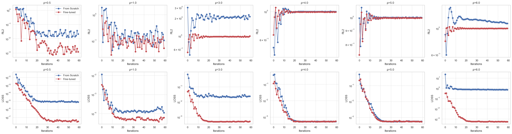
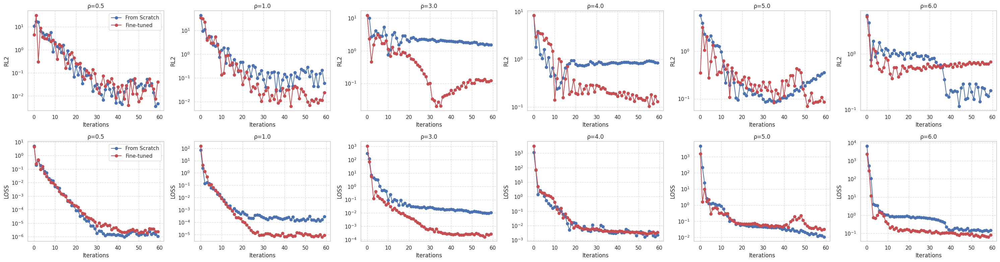

# Investigating the Transfer Learning Capability of PINNsFormers

**Heidelberg University – Generative Neural Networks (2025)**  
**Course:** Generative Neural Networks for the Sciences (Prof. Ulrich Köthe)  
**Team:** Paul Dietze, Abdulghani Almasri, Jonas Kleine  

**[Original Repo](https://github.com/AdityaLab/pinnsformer)**

---

## Description
This repository is a **fork of the original PINNsFormer repository** and contains extended experiments on transfer learning.  
The work was conducted as part of the *Generative Neural Networks for the Sciences* course at Heidelberg University (Prof. Ulrich Köthe).

The project explores how the **pretrain–finetune paradigm**, which revolutionized NLP and vision, can be applied to **Physics-Informed Neural Networks (PINNs)**.  
Specifically, we test whether **PINNsFormers**—Transformer-based PINNs—can **learn reusable "physics priors"** for parameterized differential equations.

---

## Overview

> "We wanted to see if transfer learning could turn PINNs into foundation models for PDEs."

**PINNsFormer** (Zhao et al., 2024) extends PINNs by adding a Transformer encoder–decoder with attention across pseudo-time sequences.  
In this project, we:
- Added **parameter conditioning** (e.g., reaction coefficient rho) to both PINN and PINNsFormer.
- Implemented **pretraining ? finetuning** workflows.
- Benchmarked **transfer learning**, **generalization**, and **convergence speed** vs. standard feed-forward PINNs.

---

## Code Structure

```
.
|-- model_parametrized/
|   |-- Modified model implementations with parameter conditioning (x, t, rho)
|
|-- transfer_learning/
|   |-- 1d_logistic_ode/      # All PINN & PINNsFormer experiments on low & representative regimes
|   |-- 1d_reaction/           # Transfer learning on 1D reaction PDE
|   |-- convection/            # Early PDE experiments
|   |-- demo_training_loops/   # Prototype notebooks and exploratory training scripts
|
|-- original_code/             # Provided implementation from the original PINNsFormer paper
|-- final_project_report.pdf   # Full report with detailed results and methodology
```

---

## Methodology

| Model | Input | Key Additions | Training |
|:------|:-------|:---------------|:----------|
| **Feedforward PINN (baseline)** | (x, t, rho) | Adaptive loss weighting, residual normalization | Adam (mini-batch) |
| **PINNsFormer** | (x, t, rho) | Pseudo-sequence generator, Wavelet activation, self-attention | Adam / L-BFGS hybrid |

**Tasks Evaluated**
- 1D Logistic ODE  
- 1D Reaction PDE  
- Parameter regimes: low rho in [0.5, 1.0] and representative rho in [0.5, 4.0]

---

## Experimental Results

| Experiment | Metric | Finding |
|:------------|:--------|:---------|
| **Parameter Generalization** | Pearson r(L2 error vs rho) | PINN = +0.94 (poor transfer)<br>PINNsFormer = -0.42 (improved robustness) |
| **Convergence Speed (Transfer Learning)** | Fine-tuned vs from-scratch | Up to 5x faster convergence and 92% lower error (rho = 5.0) |
| **Extrapolation** | Accuracy outside training range | PINNsFormer stable, PINN diverged |
| **Overall** | — | Transformer architecture captures broader PDE regimes and supports reusable physics priors |

---

### From-scratch training vs. fine-tuning a pretrained model


(*Standard feedforward PINNs*)

(*Pinnsformers*)


---

## Key Insights

- **Transfer learning works**: Pretrained PINNsFormers converge faster and generalize better.
- **Transformer inductive bias**: Learns global PDE structure across parameter families.
- **Range sensitivity**: Too narrow pretraining ranges cause instability and poor extrapolation.
- **Future work**: Scale to larger architectures and combine optimizers (Adam ? L-BFGS) to train *foundation models for PDEs.*

---

## Tech Stack
- **Python 3.12**
- **PyTorch 2.x**
- **Weights & Biases** for experiment tracking  
- **NumPy / SciPy** for analytical PDE solutions  
- **Matplotlib** for visualization

---

## Citation
> **Dietze P., Almasri A., Kleine J. (2025).**  
> *Investigating the Transfer Learning Capability of PINNsFormers.*  
> Heidelberg University, Institute of Computer Science.

---

## Acknowledgements
We thank **Prof. Ulrich Köthe** for guidance during the *Generative Neural Networks for the Sciences* course, and **Zhao et al. (2024)** for releasing the original PINNsFormer implementation that served as the foundation for our work.
